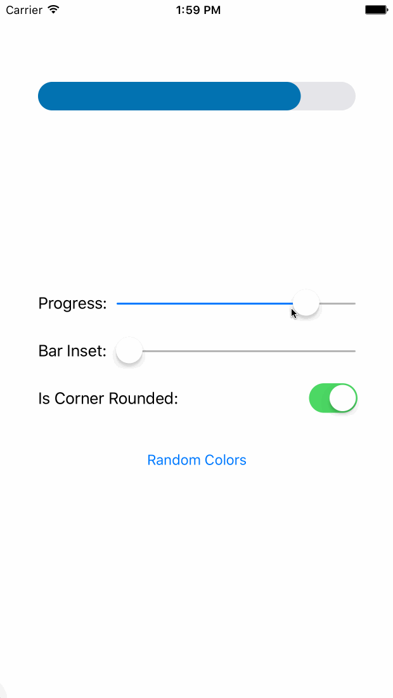
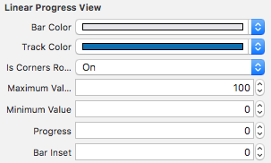

# LinearProgressView

A simple progress view for iOS
<div>
  
  
</div>

## Requirements

- iOS 8.0+
- Xcode 8.0+
- Swift 3.0+

## Installation

### CocoaPods

[CocoaPods](http://cocoapods.org) is a dependency manager for Cocoa projects. You can install it with the following command:

```bash
$ gem install cocoapods
```

To integrate LinearProgressView into your Xcode project using CocoaPods, specify it in your `Podfile`:

```ruby
source 'https://github.com/CocoaPods/Specs.git'
platform :ios, '8.0'
use_frameworks!

target '<Your Target Name>' do
    pod 'LinearProgressView'
end
```

Then, run the following command:

```bash
$ pod install
```
### Manually
Just drag and drop the [Source/LinearProgressView.swift](Source/LinearProgressView.swift) file.

## Authors

* **Orkhan Alikhanov** - *Initial work* - [OrkhanAlikhanov](https://github.com/OrkhanAlikhanov)

See also the list of [contributors](https://github.com/BiAtoms/LinearProgressView/contributors) who participated in this project.

## License

This project is licensed under the MIT License - see the [LICENSE](LICENSE) file for details
